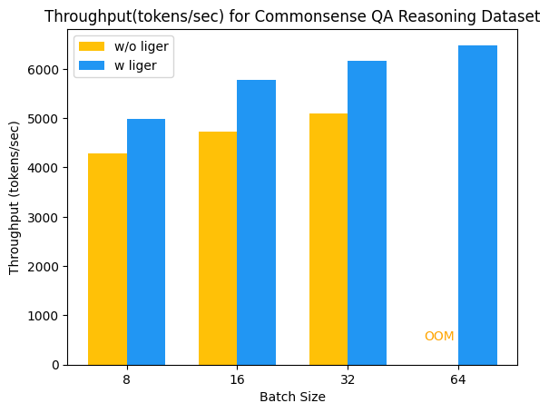
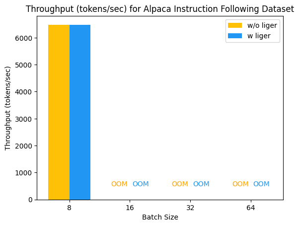
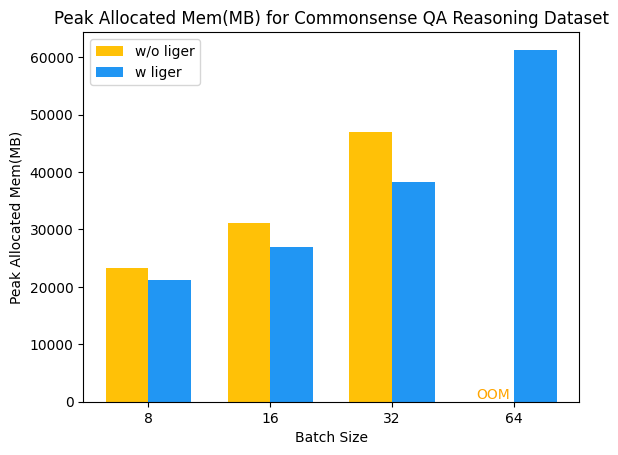

# test_liger_kernels
Benchmarking the performance of Liger Kernels Library Using instruction following and reasoning tasks

## Code Structure
```
test_liger_kernels/
├── exp/                  # Directory for storing models from various experiments
├── assets/               # Directory for storing figures and performance analysis of Liger
├── config.ini            # Configuration file containing settings for training, LoRA, and experiment folders
├── prepare_dataset.py    # Script for dataset preparation, including classes for preprocessing Alpaca and Commonsense QA data
├── finetuner.py          # Script containing Hugging Face Trainer setup and training argument configurations
├── run_finetune.py       # Main script where all modules are imported and LoRA fine-tuning is executed with or without Liger kernels
├── utils.py              # Script with helper functions, such as setting random seeds
├── callback.py           # Script from Liger Kernel repository for tracking training efficiency (memory and throughput)
├── README.md             # Documentation file for the project
└── environment.yml       # YAML file specifying the environment dependencies

```
## Throughput and Memory Analysis
my experimental setup is using 1k learning steps, tested with four batch sizes: 8, 16, 32, 64, and a context sizes 4,096 tokens to examine the performance on higher context sizes from the start. 

To thoroughly assess the benefits of using Liger Kernels, I ran these configurations under two separate finetuning settings: one using LoRA finetuning on a Llama model (bfloat16) with Liger Kernels and the other using LoRA finetuning on a Llama model without Liger Kernels. 

For all experiments, I used a learning rate of 5e-5, a weight decay of 0.01, and a warm-up phase covering 10% of the total learning steps, followed by a cosine decay scheduler to adjust the learning rate dynamically throughout training. The AdamW optimizer was employed. I used **1 GPU machine (A100 80GiBs)** 


The figures presented below demonstrate the clear benefits of using Liger kernels for LoRA finetuning. For the CommonSense_QA dataset, the use of Liger kernels resulted in a significant improvement in throughput, with an increase of 15% to 19%. Additionally, there was a noticeable reduction in memory usage, with a decrease of 10% to 19%. It is also worth noting that Liger kernels enabled the model to successfully train with a batch size of 64, where the baseline without Liger kernels failed due to memory limitations.

However, a different trend was observed with the Alpaca dataset. In this case, both configurations (with and without Liger kernels) struggled to scale beyond a batch size of 8. This behaviour requires further investigation. I attempted to reduce the context sizes to 2048 and 1024, but the same pattern persisted, indicating that the context size alone might not be the sole factor contributing to the problem. Further experimentation with different parameters and configurations is necessary to understand this limitation fully. Despite both settings eventually encountering out-of-memory (OOM) errors, it is important to highlight that using Liger kernels allowed for more training steps before hitting OOM compared to the baseline.

<div style="text-align:center;">





<br>




</div>

## Run Code:
#### Environment:
```
conda env create environment.yml
conda activate liger
```
#### datasets and model:
```
datasets=('tau/commonsense_qa' 'tatsu-lab/alpaca')
model='meta-llama/Meta-Llama-3-8B-Instruct'
```
#### Run with Liger Kernel:
```
python run_finetune.py -c config.ini --exp_name "$exp_name" --model_name "$model" --dataset_name "$dataset" --learning_steps 1000 --logging_steps 1 --include_num_input_tokens_seen --use_liger --train_batch_size "$bs" --max_seq_length "$seqlen"

```
#### Run without Liger Kernel:
```
python run_finetune.py -c config.ini --exp_name "$exp_name" --model_name "$model" --dataset_name "$dataset" --learning_steps 1000 --logging_steps 1 --include_num_input_tokens_seen --train_batch_size "$bs" --max_seq_length "$seqlen"
```
